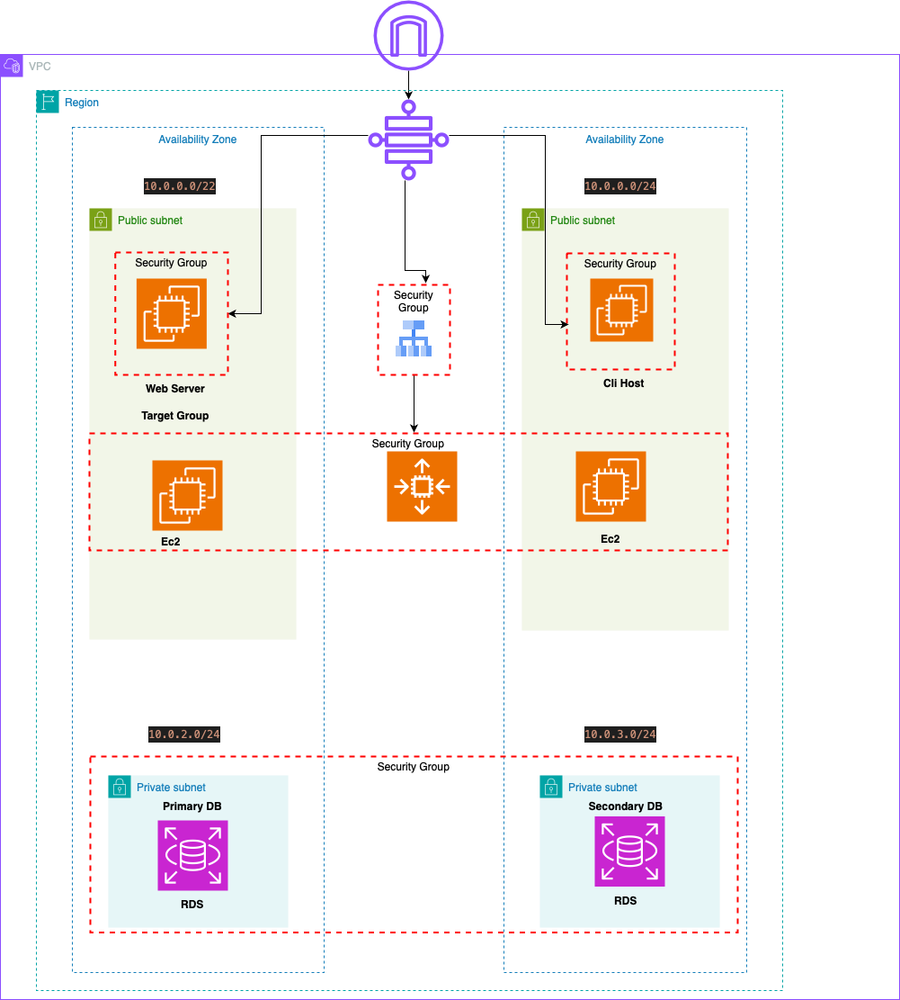

# 🚀 AWS Capstone Project: WordPress Deployment with Terraform

## 📘 Project Description

This project automates the deployment of a highly available and scalable WordPress application on AWS using Terraform. The infrastructure includes:

- **EC2 Instances**: Hosting the WordPress application.
- **Application Load Balancer (ALB)**: Distributes incoming traffic across EC2 instances.
- **Auto Scaling Group (ASG)**: Automatically adjusts the number of EC2 instances based on demand.
- **RDS (MySQL)**: Managed relational database service for WordPress data.
- **Virtual Private Cloud (VPC)**: Custom network configuration with public and private subnets.
- **Security Groups**: Control inbound and outbound traffic to AWS resources.

## 🧰 Technologies & Tools

- **AWS Services**:
  - EC2
  - RDS (MySQL)
  - ALB
  - VPC
  - Auto Scaling
  - Security Groups
- **Terraform**: Infrastructure as Code (IaC) tool for provisioning and managing AWS resources.
- **Git**: Version control system.

## 🗂️ Project Structure


AWS-capstone-Project/

 ```
├── 00.main.tf
├── 01.provider.tf
├── 02.vpc.tf
├── 03.security_groups.tf
├── 04.ec2.tf
├── 05.alb_and_asg.tf
├── 06.rds.tf
├── userdata/
│   └── wordpress.sh
├── .gitignore
└── README.md
```

- **00.main.tf**: Main Terraform configuration file.
- **01.provider.tf**: Specifies the AWS provider.
- **02.vpc.tf**: Defines the VPC, subnets, and networking components.
- **03.security_groups.tf**: Configures security groups for EC2, ALB, and RDS.
- **04.ec2.tf**: Provisions EC2 instances and associated resources.
- **05.alb_and_asg.tf**: Sets up the Application Load Balancer and Auto Scaling Group.
- **06.rds.tf**: Creates the RDS MySQL database instance.
- **userdata/wordpress.sh**: User data script to install and configure WordPress on EC2 instances.

## ✨ Features

- **Scalability**: Automatically adjusts the number of EC2 instances based on traffic.
- **High Availability**: Deploys resources across multiple Availability Zones.
- **Security**: Implements security groups to control access to resources.
- **Infrastructure as Code**: Uses Terraform for consistent and repeatable deployments.

## 📊 Architecture Diagram




## 🛠️ Prerequisites

- **AWS Account**: Active AWS account with necessary permissions.
- **Terraform**: Installed on your local machine. [Download Terraform](https://www.terraform.io/downloads.html)
- **AWS CLI**: Configured with your AWS credentials. [Install AWS CLI](https://docs.aws.amazon.com/cli/latest/userguide/install-cliv2.html)

## 🚀 Deployment Instructions

1. **Clone the repository**:

   ```bash
   git clone https://github.com/fatemehnasirpour/AWS-capstone-Project.git
   cd AWS-capstone-Project